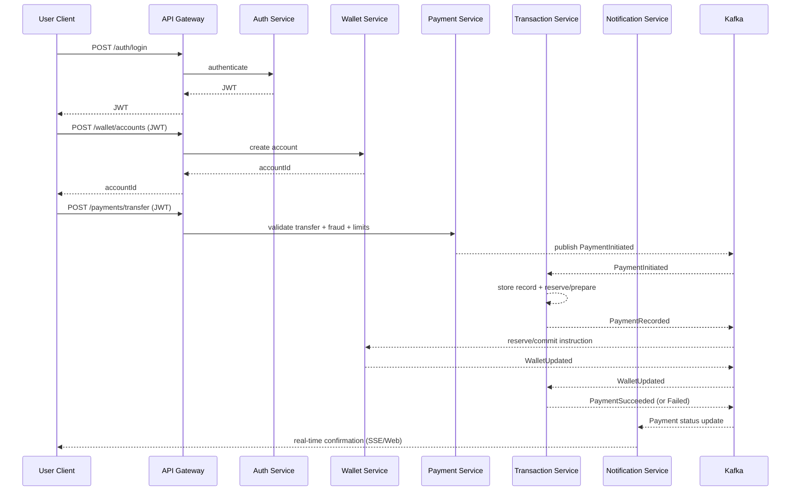
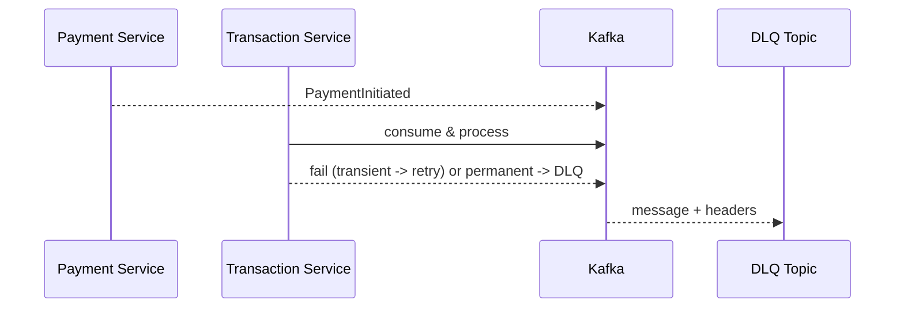

# API Flow Diagrams

## 1) Payment request (happy path)

```mermaid
sequenceDiagram
  participant U as User Client
  participant GW as API Gateway
  participant AUTH as Auth Service
  participant W as Wallet Service
  participant P as Payment Service
  participant T as Transaction Service
  participant N as Notification Service
  participant K as Kafka

  U->>GW: POST /auth/login
  GW->>AUTH: authenticate
  AUTH-->>GW: JWT
  GW-->>U: JWT

  U->>GW: POST /wallet/accounts (JWT)
  GW->>W: create account
  W-->>GW: accountId
  GW-->>U: accountId

  U->>GW: POST /payments/transfer (JWT)
  GW->>P: validate transfer + fraud + limits
  P-->>K: publish PaymentInitiated

  K-->>T: PaymentInitiated
  T-->>T: store record + reserve/prepare
  T-->>K: PaymentRecorded

  K-->>W: reserve/commit instruction
  W-->>K: WalletUpdated

  K-->>T: WalletUpdated
  T-->>K: PaymentSucceeded (or Failed)

  K-->>N: Payment status update
  N-->>U: real-time confirmation (SSE/Web)
```

## 2) Failure path with DLQ

```mermaid
sequenceDiagram
  participant P as Payment Service
  participant T as Transaction Service
  participant K as Kafka
  participant DLQ as DLQ Topic

  P-->>K: PaymentInitiated
  T->>K: consume & process
  T-->>K: fail (transient -> retry) or permanent -> DLQ
  K-->>DLQ: message + headers
```

